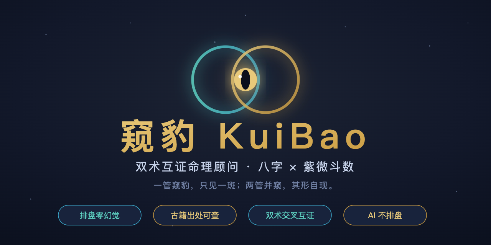

# 窥豹 KuiBao — 双术互证命理顾问（八字 × 紫微斗数）



   

> **管中窥豹**：一管窥豹，只见一斑；两管并窥，其形自现。
> 八字与紫微是两套独立演化的命理体系——对同一张命盘各给一个答案，两个答案**互相印证或互相矛盾**，矛盾处就是结论最需要谨慎的地方。本项目把「互证」做成了架构，而不是话术。

**30 秒看懂**：输入出生年月日时 + 出生地 + 性别 + 关注领域 → 八字与紫微双排盘（**确定性代码，AI 不排盘，零幻觉**）→ 知识库 RAG 取证 → 每条结论带古籍出处与置信度的约束式解读，双术矛盾时输出条件式结论而不是和稀泥。产品立场：**传统文化参考**。

## 为什么是它：五条同类项目没有的护城河

2026-09 对 GitHub 上五个同类高星项目（bazi-skill 2.9k★ / Numerologist 1.1k★ / 太卜 518★ / 命语 378★ / Horosa 365★）做过逐项对比（对比方法与数据核实见 `docs/`）：

| 能力 | 同类项目 | 窥豹 |
|---|---|---|
| **双术互证** | 全部是「多术数并列」，各算各的 | 八字×紫微交叉验证，冲突时输出条件式结论（S1–S3 合成），置信度随一致性升降 |
| **强制出处 + 硬门禁** | 至多「不许乱补参数」 | 每条解读必须挂 `[KB-xxx]` + 《书名》出处，双重校验，三轮不过**拦截不输出** |
| **排盘三级对拍** | 至多库自证的回归测试 | L1 结构自检 + L2 独立公式对拍（4.2 万项）+ L3 跨实现对拍（Node×Python 8000 项） |
| **定盘（时辰校准）** | LLM 自由提问后「微调」 | 贝叶斯后验 + 信息增益选题，答对答错有明确概率语义，自洽性 14/15 |
| **知识库版权分级** | 无一处理过 | 596 条全部打 `license` 标签，`KB_PUBLIC_ONLY=1` 一键只用品德公版古籍（48 条） |

另有一条同类项目普遍缺失、本项目视为底线的：**澄清闸**——城市未收录、1986–91 夏令时、闰月、23 时子时口径等影响排盘的未知量，未确认前**结构化拦截（HTTP 422）不出报告**，消灭「地基歪了但报告很流畅」。

## 架构

```
采集层（公历/农历输入，农历服务端确定性转换）
→ 澄清闸 preflight（信息不全先澄清，硬拦截）
→ 排盘层 chart（确定性：lunar-javascript + iztro；真太阳时/夏令时/子时三档/闰月两派/流年四化）
→ 互证合成 synthesize（五领域信号 + 双术一致/冲突判定 + 置信度）
→ 知识层 retrieve（关键词打分检索，双术配额保证两侧都有条文）
→ 解读层 interpret（LLM 受约束：RAG 注入 + 出处校验 + 违规重生成 + 降级兜底）
→ 质检（bench drift + 三类硬门禁 + stability 一致性）
→ 展示/导出（Web / DOCX / 打印 PDF）
→ 回流（会话归档 + 反馈自带归因快照 + Wilson 区间归因分析）
```

## 快速开始

```bash
git clone https://github.com/zhangmanyue738-eng/kui-bao.git
cd kui-bao
npm install
cp .env.example .env          # 填入 DEEPSEEK_API_KEY（platform.deepseek.com，国内直连）
npm run doctor                # 环境体检（46 项），确认就绪
npm start                     # http://127.0.0.1:3766
```

macOS 用户可直接双击 `启动命理顾问.command`。

**公版模式**（只用公版古籍，剔除现代整理内容）：

```bash
KB_PUBLIC_ONLY=1 npm start
```

## 质量门禁（改代码后必跑）

```bash
npm test                      # schema + bench drift + reportcheck + badcase:check + verify + crosscheck
npm run test:full             # test 全链 + stability（同盘多次一致性）

node src/verify-chart.js 3000 # 独立规则对拍：五虎遁/五鼠遁/日柱连续性/大运顺逆/紫微命宫身宫
node src/cross-check.js 1000  # 跨实现对拍：Node lunar-javascript × Python lunar-python
node src/build-kb.js          # 重建知识库（改了 knowledge/ 后执行）
npm run badcase               # 归因报告（真实反馈攒到几十条后才有意义）
node src/eval.js              # LLM 端到端质检（走真实 API）
```

当前基线：verify **42894/42894（100%）**、crosscheck **8000/8000（100%）**、eval deepseek-chat **22/22**、drift 63/63 一致、doctor 46 项通过。评测报告按日期存于 `docs/`。

## 给 AI Agent / 贡献者

仓库根的 **`SKILL.md`** 是完整的开发与维护工作流：28 条实测踩坑清单、铁律、全套命令与排查路径——改代码前先读它，能避开我们踩过的所有坑。设计细节（互证规则、定盘设计、排盘准确性验证）在 `docs/`。

## 设计铁律（不可违反）

1. **排盘零幻觉**：排盘绝不交给 LLM，全用确定性库（lunar / iztro）计算；LLM 只读排盘 JSON
2. **解读必有出处**：引用只能出自知识库检索条文，模型自由发挥=违规重生成
3. **模型实测挑选**：底座用评测集挑，不迷信宣传（deepseek-chat 22/22 完胜 reasoner 68% 且更快更省）
4. **粒度不超计算层**：流年只允许全年方向——流月无计算无条文，提示词就不许许诺月度结论
5. **错误必须可见**：凡影响结果的未知量，先澄清后计算，禁止静默默认值

## 知识库与版权

- 紫微侧：`knowledge/ziwei-doushu/`（来自 [Renhuai123/ziwei-doushu](https://github.com/Renhuai123/ziwei-doushu) 的数据文件，MIT；只保留本项目引用的部分，详见该目录 README）
- 八字侧：`knowledge/bazi-classics/`（源自 stephenxu007-ux/bazi-destiny-master）
- 每条带 `license` 标签：**public_domain** 48 条（《渊海子平》《穷通宝鉴》《紫微斗数全书》等公版古籍原文）/ **modern** 548 条（现代整理断语）
- 自用：两者都用；**对外服务或公开部署请开启 `KB_PUBLIC_ONLY=1`**，或自行补齐现代内容的授权
- 重建：`node src/build-kb.js`；调候表：`node src/extract-tiaohou.js`

## 免责声明

本项目输出为**传统文化参考**，不构成医疗、法律、投资、婚姻等任何专业建议；禁止用于生死寿元、重大疾病等事件断言；输出粒度与句式均受硬门禁约束（健康禁疾病名、婚姻禁克夫克妻、流年禁月度/逐日断言、禁绝对化措辞）。人生走向取决于个人选择与行动。

## License

MIT（含第三方数据归属声明，见 `LICENSE` 与 `knowledge/ziwei-doushu/README.md`）。
